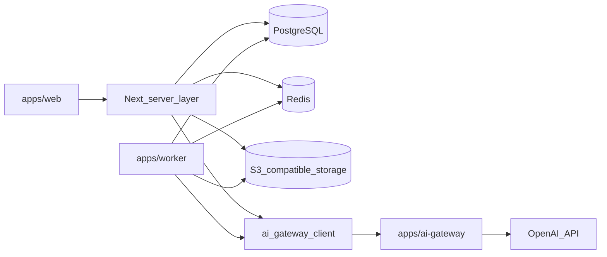

## Архитектура (каркас)

### Контуры

- **product_contour**: `apps/web`, `apps/worker`, PostgreSQL, Redis, S3‑совместимое хранилище.
- **ai_contour**: `apps/ai-gateway` + OpenAI API.

Правило ТЗ: продуктовый контур не должен напрямую вызывать OpenAI API.

### Vendor lock-in (адаптеры)

Интеграции подключаются через адаптеры/контракты (будут развиваться по мере реализации модулей):

- `AIProvider` через `AiGatewayClient`
- `StorageProvider`
- `OCRProvider`
- `EmailProvider`
- `QueueProvider`

